# Context

The objective of these interviews was to investigate the need for digital tools to support security management in the NGO sector. We wanted to better understand how security information and documentation were currently managed and explore how digital tools could facilitate the management of security for NGOs. We did not discuss security management practices as such.

# Disclaimer

This summary is based on a total of 8 interviews. The sample size is small and the picture that this summary draws cannot be considered as representative of the sector. That being said, you will note that there are a lot of commonalities between the organizations that were interviewed. We are still conducting interviews and will update the summary accordingly.

# People & Organizations

All interviewees were global Security Managers at HQ level.

We interviewed a diverse set of organizations:

- [GRET](https://gret.org/)
- [Première Urgence Internationale](https://www.premiere-urgence.org/)
- [Oxfam International](https://www.oxfam.org/en)
- [Croix Rouge Française](https://www.croix-rouge.fr/)
- [Medicos Del Mundo](https://www.medicosdelmundo.org/)
- [The Lutherian World Federation](https://www.lutheranworld.org/)
- [Handicap International / Humanity & Inclusion](https://www.handicap-international.fr/)
- [La Chaine de l’Espoir](https://www.chainedelespoir.org/fr)

# Organizational Structure & Chain Of Validation

All the organizations we spoke to have the same 4-level structure. Security Plans are created for each base of operations.

Another commonality is the fact that the validation of Security Plans happens upwards and that it follows the operational chain of accountability. A base, country office or region/desk can have dedicated Security Focal Points/Advisors when resources are available and/or the threat level requires it. In most cases, the last validation happens at the Region/Desk level. The role of the Global Security Manager is not to validate plans, but to define best practices, build the tools, support when needed and increase organizational accountability. Field coordinators, head of missions and desk managers remain accountable for security management.

# Risk Assessments & Ratings

All interviewees have very similar scoring models for risk assessments:

- Scoring is the product of Probability and Impact of a risk.
- An Initial Score assesses the situation before any mitigation measures are applied.
- An Residual Score assesses the situation taking into account the mitigation measures being applied.

Consensus on the fact that tools are just tools (content is what matters), but having a structured way to organize helps a lot. Excel is the tool of choice for risk assessments. In any case, the context analysis is the starting point of a risk assessment.

In addition to the risk assessment tool, a few organisations mentioned that they rank each base with a score from 1 to 5. They use predefined set of indicators to compute a weighted average to define the safety phase. That allows for comparing bases with a single metric.

An interviewee emphasized the fact that, beyond performing standardized risk assessments, organizations should also think about and define what level of risk is acceptable for them.

# Problems

We ask interviewees about the main problems/pain points they faced and whether it affected field and/or HQ staff. The impact of these problems varies between organizations (most likely due to size, structure, contexts of operation, ...) so it is hard to draw any conclusions from that specific information. The following list outlines the top pain points that were raised by all organizations.

## Lack Of Training

By far the main issue that was mentioned by interviewees, both for staff at field and HQ levels. Interestingly, multiple root causes where mentioned in the realms of budget, operational setup, human resources, hiring... The following diagram attempts to structure the relationships between them.

- Staff in charge of security are often not doing this full time. Their operational roles tend to take priority and little time is left on security management, including for trainings.
- The fact that there is no academic degree nor clear career path in security management creates high turnover (people do the job only for a limited time) and means that staff have to learn on the job. Both exacerbate the need for robust training approaches in organizations.
- Finally, the competition among NGOs for skilled workers is increasing due to the combination of high demand (NGOs are more exposed to high risk areas than ever) and limited offer (no clear career path).

## Low Scalability Of Tools & High Volume Of Information

Tools and processes are hard to deploy at scale within organizations. Security plans are composed of many different documents that need to be kept up to date at a controlled frequency. Doing so and keeping track of the status of each document was reported as quite tedious. This leads in many cases to a lack of completion of all the security tools. Organizations seem to be proactively iterating on the problem by simplifying the tools and limiting the amount of information that needs to be collected, processed and produced.

## Low Tech Proficiency In The Field

NGOs operate in a wide range of contexts. It is not always easy to find staff that are proficient using even Microsoft Office. This affects the quality and timeliness of documents that are produced, hence adding work of other stakeholders in the security management chain. This is often compounded with the fact that the tools themselves are not designed for that mixed audience of users (not that it’s actually possible with MS Excel or MS Word).

## Data Protection & Information Sharing

Data protection and the ability to share information with specific individuals was consistently mentioned by interviewees as a challenge. There is a tension between making security information available to as many people as possible while controlling the access of a small subset of privileged information (such as incident reports or external contacts). The assumption is that the current tools (ex: SharePoint) have limits and do not feet the exact use cases of security management.

There seems to be a good level of awareness of the cyber security threats targeting NGOs, without stating specific measures. Some mentioned using encrypted data storage in very specific situations.

# Digital Tools

What tools organizations use to process, compile and share the security related information?

## Document Creation

**Tools** - [Microsoft Office](https://www.microsoft.com/fr-fr/microsoft-365/microsoft-office) - Word, Excel, PowerPoint

**Comment** - All organizations we spoke to use Microsoft Office 365 as their office suite. Structured documents such as Risk Analysis are done with Excel while most other narrative documents use Word.

## Document Sharing

**Tools** - [Microsoft SharePoint](https://www.microsoft.com/fr-fr/microsoft-365/sharepoint/collaboration)

**Comment** - Organizing and appropriately sharing information is seen as growing (and major) concern. With different levels of maturity, SharePoint is being used as an access-controlled shared online drive all the organizations we interviewed.

## App Development & Automation

**Tools** - [Microsoft Power Apps](https://powerapps.microsoft.com/en-gb/), [Agileo](https://www.agileo.com/en)

**Comment** - An good indicator that organizations are looking to further streamline their security management practices is the fact that they rely more and more on purposely built applications and automation. In most cases the development of these application is done with internal resources, with people learning as they go. Because of the heavy reliance on the Microsoft ecosystem, the organizations that we’ve interviewed had built applications (web an mobile) with Microsoft Power Apps. The most common use cases where Security Plan validation and Incident Reporting. An organization automates the travel validation process with Agileo and notifications are sent to the Security Manager for high risk locations.

## Dashboards

**Tools** - [PowerBI](https://www.microsoft.com/en-us/power-platform/products/power-bi/)

**Comment** - Building dashboards has become a must-have skill for most organizations. Security Management seems to be well onboard with that trend. Quite a few organizations we spoke to have built PowerBI dashboards to visualize their data on Incident Reports.

## Geographic Information Systems (GIS)

**Tools** - [OpenStreetMap](https://www.openstreetmap.org/), [Umap](https://umap.openstreetmap.fr/en/), [QGIS](https://www.qgis.org/en/site/), [ArcGIS](https://www.esri.com/en-us/arcgis/products/arcgis-online/overview)

**Comment** - The use of maps is certainly not new in the field of Security Management. But their seems to be a growing interest in internalizing GIS skills. Organizations we spoke to all use them, but some have invested in specialized staff and software, even proprietary such as ArcGIS from Esri.

## Communication

**Tools** - [Whatsapp](https://www.whatsapp.com/), [Signal](https://signal.org/), [Microsoft Teams](https://www.microsoft.com/fr-fr/microsoft-teams/group-chat-software/), Email

**Comment** - While email remains the default way of communicating non-urgent information, instant messaging applications (Whatsapp, Signal) are widely used on the field for faster information sharing. These groups are managed by the field staff directly. Several organizations are trying to put some structure to this type of communication to limit the number of groups and introduce usage guidelines.

## eLearning

**Tools** - n/a

**Comment** - We have not specifically inquired about the tools used for eLearning purposes, but it was interesting to notice that, in the organizations that had a global eLearning platform, security managers did use it as a vector to disseminate information.

## Information, Data & Services

We also asked you the 3rd party services you were using. The ones with a ⭐ were mentioned the most.

- [Sibylline](https://www.sibylline.co.uk/)
- [Control Risks](https://www.controlrisks.com/)
- [International SOS](https://www.internationalsos.fr/) ⭐
- [Global Interagency Security Forum (GISF)](https://www.gisf.ngo/)
- [ACAPS](https://www.acaps.org/) ⭐
- [ACLED](https://acleddata.com/) ⭐
- [INSO](https://ngosafety.org/) ⭐
- [Aid Worker Security Database](https://aidworkersecurity.org/)
- [Humanitarian Data Exchange (HDX)](https://data.humdata.org/)
- [Africa Intelligence](https://www.africaintelligence.fr/)